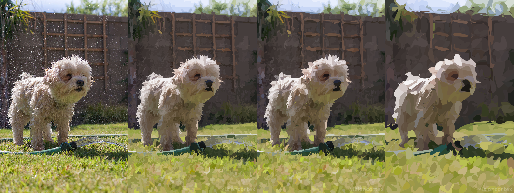

  
  <h1>Vision Magic</h1>

  

    <strong>Collection of vision & graphics algorithms</strong>
  

  <h3>
    <a href="//www.visioniechor.org/impression-docs">Article</a>
     | 
    <a href="//www.visioniechor.org/visionmagic/">Demo</a>
     | 
    <a href="//docs.rs/visionmagic">Docs</a>
  </h3>

  Built with 🦀 by <a href="//www.visioniechor.org/">The Vision iEchor Research Group</a>

# Impression

Impression is a set of algorithms in the Statistical Region Merging family for image simplification and segmentation.

## Simplification

## Segmentation

## Image Repairing

### FMM

We experimented with "An image inpainting technique based on the fast marching method"
